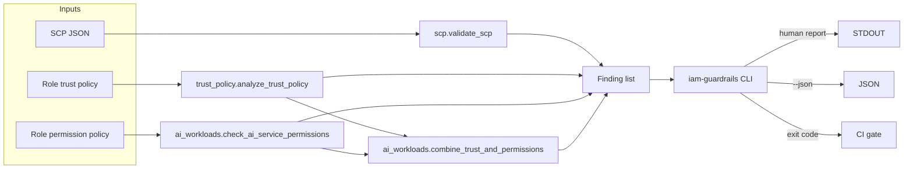

# iam-guardrails

[](https://github.com/SentinelByte/enterprise-iam-guardrails/actions/workflows/ci.yml)
[](https://github.com/SentinelByte/enterprise-iam-guardrails/actions/workflows/codeql.yml)
[](LICENSE)
[](pyproject.toml)

A small, offline-first tool for catching the AWS IAM mistakes that actually
cause incidents: wildcard trust policies, Service Control Policies that
silently do nothing (or too much), and — the part most scanners skip —
over-broad permissions on Bedrock/SageMaker execution roles. Every finding
comes with a concrete fix, and the CLI exits non-zero on anything serious,
so it can gate a pipeline instead of just printing a report nobody reads.

## Why this exists

Generic IAM scanners try to cover everything and end up saying a little
about a lot. I'd rather cover a short list of patterns really well: the
ones that keep showing up in real incident writeups (wildcard `AssumeRole`
principals, SCPs written as an unconditioned `Allow *`, external accounts
trusted with no `sts:ExternalId`). And as more workloads run on Bedrock and
SageMaker, "who can invoke this model" and "who can turn off the audit log"
are becoming ordinary IAM questions that most tools don't ask yet. See
[THREAT_MODEL.md](THREAT_MODEL.md) for what each check is actually looking
for, and what this tool deliberately doesn't try to do.

## Architecture



Each check works fine on its own, but `ai_workloads` also pulls trust and
permission findings back together for the same role — a role that's both
easy to assume *and* highly capable is worse news than either fact alone,
so it gets called out as its own, higher-severity finding. See
[`combine_trust_and_permissions`](src/iam_guardrails/ai_workloads/checks.py).

## Install

```bash
uv venv && uv pip install -e ".[dev]"
```

## Usage

```bash
# Structural + semantic validation of a Service Control Policy
iam-guardrails validate-scp policy.json

# Trust policy risk analysis — offline, or --live to scan the whole account
iam-guardrails scan-trust-policy trust.json --role-name my-role --account-id 111111111111
iam-guardrails scan-trust-policy --live

# AI/ML execution role: combine trust boundary + AI permission blast radius
iam-guardrails scan-ai-workloads trust.json permissions.json --role-name bedrock-agent-role
```

Example output:

```
$ iam-guardrails scan-ai-workloads tests/fixtures/trust_wildcard.json tests/fixtures/ai_policy_broad.json --role-name bedrock-agent-role
[CRITICAL] trust_policy.wildcard_principal (bedrock-agent-role)
    Trust policy allows Principal "*" to assume this role.
    remediation: Replace the wildcard with explicit account/role ARNs. If this is
    intentional (e.g. a public SAML/OIDC-fronted role), the restriction must happen
    entirely in the Condition block — verify one is present and sufficiently strict.
[CRITICAL] ai_workloads.broadly_trusted_ai_role (bedrock-agent-role)
    Role 'bedrock-agent-role' combines a weak trust boundary (Trust policy allows
    Principal "*" to assume this role.) with broad AI-service permissions (Statement
    grants 'bedrock:*' on all resources — unrestricted control over the AI service,
    including model access, data, and configuration.). Compromise or misuse of this
    role's trust relationship directly translates into AI-service impact, not just
    generic account access.
    remediation: Tighten the trust policy first (see trust_policy findings), then
    re-run this check — the permission grants may be acceptable once the role is
    no longer broadly assumable.
[HIGH] ai_workloads.wildcard_service_permissions (bedrock-agent-role:BroadBedrockAccess)
    Statement grants 'bedrock:*' on all resources — unrestricted control over the
    AI service, including model access, data, and configuration.
    remediation: Enumerate the specific actions the workload needs and scope
    Resource to approved model/endpoint ARNs.
[HIGH] ai_workloads.logging_config_mutable (bedrock-agent-role:CanDisableLogging)
    'bedrock:DeleteModelInvocationLoggingConfiguration' lets this principal disable
    or rewrite Bedrock invocation logging, removing the audit trail for model usage.
    remediation: Restrict logging-configuration actions to a break-glass admin role,
    separate from workload roles.
$ echo $?
1
```

Add `--json` to any command for machine-readable output.

## Development

```bash
uv pip install -e ".[dev]"
pre-commit install
pytest              # 93%+ coverage, moto-mocked AWS calls, no live account needed
ruff check .
mypy src/           # strict mode
bandit -c pyproject.toml -r src/
```

See [CONTRIBUTING.md](CONTRIBUTING.md) for what a PR needs to pass before it merges.

## License

GPL-3.0-or-later — see [LICENSE](LICENSE).

*SentinelByte, 2026*
